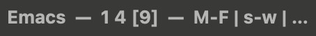

# keys

Put all your crazy Emacs keys in the mode-line, frame title, or wherever! `keys`
helps you learn them!



## Features

keys is a simple, unopinionated package with two main features:

- A configurable display to remind you about keybindings you want to learn. Keys
  are removed from the display (called the *indicator*) when they're typed.
- Error messages if you fail to use one of your keys to invoke a command (i.e.
  `M-x`).

For example, you can try to use all your keys every day, and set `midnight-mode`
to reset them for the next day. See below!

## Get started

For a totally basic setup, this turns on `global-keys-mode` and sticks some keys
in your frame title:

```el
(use-package keys
  :load-path "~/.emacs.d/packages/keys" ; Coming to MELPA soon I hope

  :config

  (setq keys-keys '("s-w" "M-F" "C-M-y"))

  ;; Update the indicator every time it should change.
  ;; You can also just do `(:eval (when global-keys-mode (keys-indicator)))`,
  ;;   but this avoids constantly re-calculating the indicator.
  ;; The same idea applies for the mode-line, header, etc.
  (defvar frame-title-keys)
  (defvar frame-title-separator "  —  ")
  (setq frame-title-format '("Emacs" frame-title-keys))
  (add-hook
   'keys-post-change-hook
   #'(lambda ()
       (let ((indicator (keys-indicator)))
         (setq frame-title-keys
               (when (and global-keys-mode (not (string-empty-p indicator)))
                 (format "%s%s" frame-title-separator indicator))))))

  ;; Ready to turn on keys-mode!
  (global-keys-mode)
  )
```

And here's an example exposing more configuration knobs:

```el
;; In :config section...

;; Customize some settings
(setq
 keys-keys '("s-w" "M-F" "C-M-y" "C-x 2" "C-M-," "C-S-v" "s-D" "M-W")
 keys-display-amount 2 ; How many keys to show at once
 keys-indicator-separator " | " ; Customize the indicator!
 keys-random t ; By default, keys are shown in a random order

              ; Calling associated commands manually is an error!
 keys-force t ; So if you bind `git-link` to C-c g, you get an error when
              ; invoking `M-x git-link` with this configuration set.
 )

;; Integrate with midnight-mode.
(require 'midnight)
(midnight-delay-set 'midnight-delay "1:00am")
(add-hook 'midnight-hook 'keys-reset)
```

## TODO

This repo is basic right now, but I see potential for something really cool if
anyone wants to run with it.

- [ ] EASY: Allow setting disallowed commands. For example, if you have
      `my-other-window`, disallow `other-window` to help you learn the new one.
- [ ] Support for keymaps.
- [ ] Support detecting prefix arguments, e.g. `C-u C-u C-;`.
- [ ] Functions to automate adding indicator to mode/header/frame-title for the
      user.
- [ ] Some nice statistics for key usage.

## Disclaimer

If you use this I'm not liable for your microwave exploding.

But seriously, I realized while developing this how much Emacs and LISP were
holding me back in life. I won't develop this anymore, but I'm giving it as a
service to the community. But I'll merge *any* PRs that are submitted. Raise a
PR deleting everything? Merged! (Luckily no one reads these disclaimers.)
